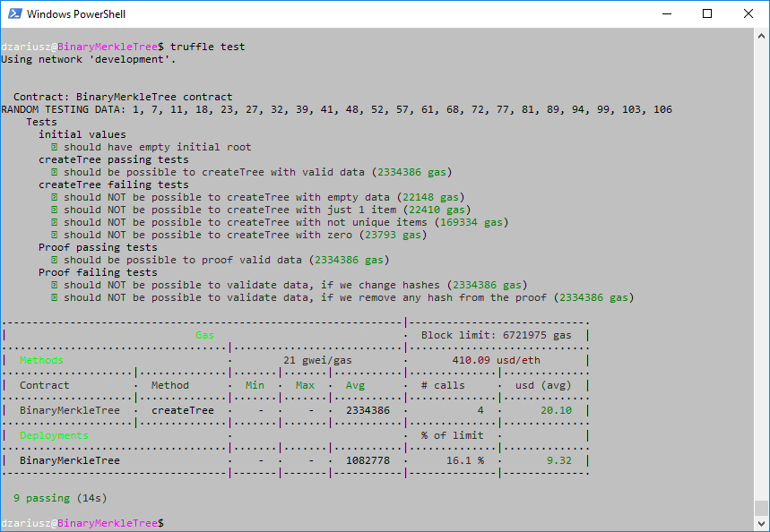

# Binary Merkle Tree

**NOTICE:** This is recruitment task: simple implementation of Merkle Tree in Solidity.

It has a lot of limitations but the **mission** here is just to show how to build simple Merkle Tree.


I'm aware that internet has a lot of ready to go examples of Merkle Tree implementations and libraries.
Normally I would use them and include into the code, to speed up development process,    
but here, I'm not using any external sources, I'm building it from the scratch, just to show, that I can. 

 

## Limitations

I cut the functionality to absolute minimum, to show the solution asap.  
Main limitations: 

* Input data are array of unique, positive numbers.
* You need to provide all the data at once.
* Merkle tree is created at once in one transaction and can't be changed. 
* Tests are enough for this presentation, but we can think of much more for live product.


## About it

Solidity Smart contract can be found here `contracts/BinaryMerkleTree.sol`. 
I put there a lot of comments about a code and possible other solutions. 
 
Tests are base on random data - each time you run the tests, you are creating new, random merkle tree.


## How to run it?

You must have truffle and nodejs installed in your environment, then run:
```
npm install

# run test ethereum network
ganache-cli -b 3

# then in another console:
truffle compile
truffle migrate
truffle test
```

Results of tests:




Hope you like it.

Mission accomplished.
